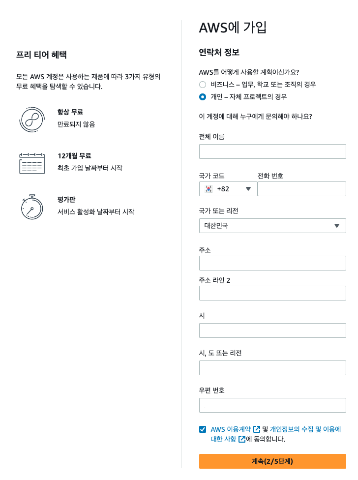

### 1.  AWS 사이트에 접속한다
 
 

 AWS 프리 티어
프리 티어는 계정을 생성하면 12개월 동안 특정 서비스를 무료로 사용할 수 있는 것을 말합니다.

다만 정말 12개월 동안 모든 것을 무료로 사용할 수 있는 게 아니기 때문에 잘 확인해 보시고 사용해야 요금이 발생하지 않습니다.

자세한 내용은 아래의 링크에서 "프리 티어 세부 정보"에서 확인해 보시기 바랍니다.

[👉 프리 티어 세부 정보](https://aws.amazon.com/ko/free/?all-free-tier.sort-by=item.additionalFields.SortRank&all-free-tier.sort-order=asc&awsf.Free%20Tier%20Types=*all&awsf.Free%20Tier%20Categories=*all)

메인 화면에 있는 [무료 계정 생성]을 클릭!

 

 

### 2. 가입에 사용할 이메일과 계정 이름을 적은 후 [이메일 주소 확인] 클릭

주로 사용하는 이메일과 영문 이름을 입력합니다

 

 

### 3. 가입 정보를 적은 후 [계속] 클릭

이름, 국가코드, 전화번호, 국가, 주소, 주소라인, 시, 시, 또는 리전 등 모든 항목이 필수 항목이므로 적어준다. 전부 영어로 기록해주세요.

(+) 주소는 영문으로 적어야 함으로 아래 네이버 영문 주소 검색을 통해서 입력한다.

 
 [네이버영문주소 : 네이버 검색](https://search.naver.com/search.naver?where=nexearch&ie=utf8&X_CSA=address_search&query=%EB%84%A4%EC%9D%B4%EB%B2%84%20%EC%98%81%EB%AC%B8%EC%A3%BC%EC%86%8C)

 

### 4. 카드 정보를 입력한 후 [확인 및 계속] 클릭

무료로만 사용할 거긴한데, 인증하는 차원에서 100원결제 했다가 나중에 취소하는 작업이 필요해서 필수로 적어줘야 함. 

 

### 5. 카드 비밀번호 / 생년월일 입력후 [다음] 클릭

본인 확인을 위해 100원 결제가 됨. (나중에 취소)

 

 
### 6. 내가 입력한 전화번호로 코드를 전송하고 휴대폰으로 받은 코드를 입력해준후 [계속] 클릭

 

### 7. 가입 플랜을 선택후 [가입완료] 클릭

일단 무료로 사용할 거니까 기본지원 - 무료를 선택해준다.

 

 

### 8. 가입완료
 

 