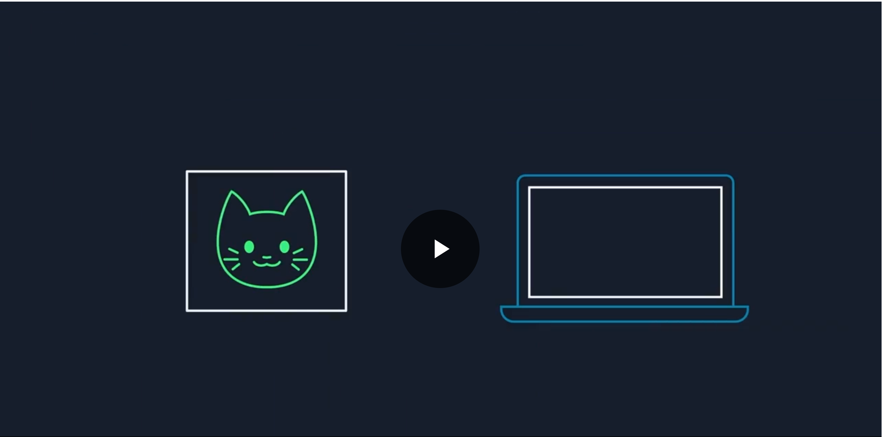

##  AWS 글로벌 인프란란?

### 상황

직원 디렉터리 애플리케이션에서는 각 직원의 사진을 사용합니다. 

### 🟦 AWS 글로벌 인프라 쉽게 이해하기

#### 1. 왜 사진을 AWS에 저장할까?

1. 내 랩톱에만 사진이 있으면 고장 나면 사라짐 ❌

2. AWS에 올리면 전 세계 어디서나 접속 가능하고 안전하게 보관됨 ✅

---

#### 2. AWS의 데이터 보호 방식: 중복성

1. **데이터 센터(Data Center)**: 실제 서버가 있는 물리적 장소

2. **가용 영역(AZ, Availability Zone)**:

    - 한 개 이상의 데이터 센터로 구성

    - 전력·네트워크 등이 중복으로 구성 → 하나가 망가져도 다른 곳이 계속 운영

3. **리전(Region)**:

    - 여러 AZ가 모여서 하나의 지역 단위가 됨

    - 예: 버지니아 북부 리전(us-east-1)

👉 구조: **데이터 센터 ⟶ AZ ⟶ 리전**

#### 3. 리전 선택 기준 4가지

1. **규정 준수 (Compliance)**

    - 법/규정 때문에 특정 국가 내에 데이터 저장해야 하는 경우

    - 예: 영국 데이터는 반드시 런던 리전에

2. **지연 시간 (Latency)**

    - 사용자와 서버 거리가 가까울수록 빠름

    - 오레곤 사용자라면 오레곤 리전 선택

3. **요금 (Cost)**

    - 리전마다 가격이 다름

    - 상파울루(브라질) 리전은 세금 때문에 비쌀 수 있음

4. **서비스 가용성 (Service Availability)**

    - 모든 서비스가 모든 리전에 동시에 제공되지 않음

    - 최신 서비스를 쓰고 싶다면, 서비스 제공 리전을 확인해야 함

---

#### 4. 글로벌 엣지 네트워크

1. **엣지 로케이션(Edge Location)**: 사용자와 가까운 곳에 데이터를 임시로 저장(캐싱)

2. **리전 엣지 캐시**: 엣지 로케이션과 리전 사이에서 캐시 최적화

3. **활용 예시**: Amazon CloudFront (CDN 서비스)

    - 자주 보는 콘텐츠를 전 세계 엣지 로케이션에 캐시

    - 사용자는 가장 가까운 곳에서 다운로드 → 속도 ↑, 지연 ↓

---

### 📌 핵심 요약

1. **데이터 센터 → AZ → 리전**: 중복성으로 안전하게 데이터 보호

2. **리전 선택 기준**: 규정 준수 → 지연 시간 → 요금 → 서비스 가용성

3. **엣지 로케이션**: 전 세계 사용자에게 빠르게 콘텐츠 전달 (CloudFront 활용)

👉 AWS는 전 세계 어디서나 **안전하고 빠르게** 데이터를 저장하고 제공할 수 있는 인프라를 갖추고 있음.

---

