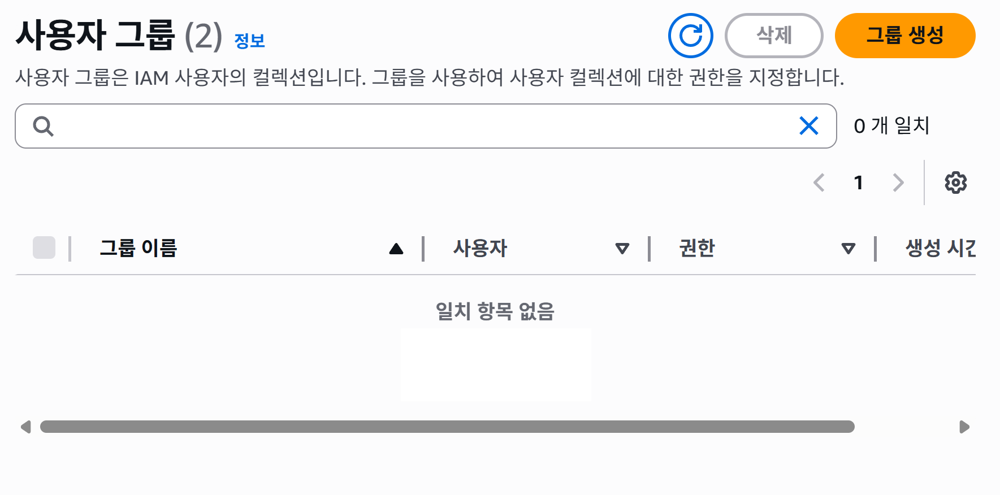
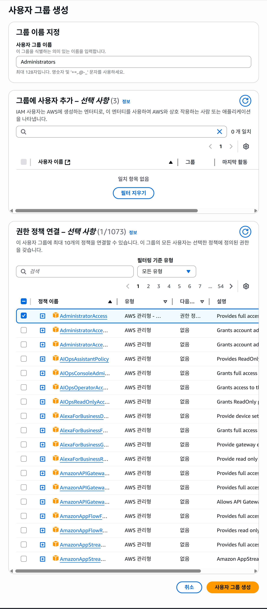
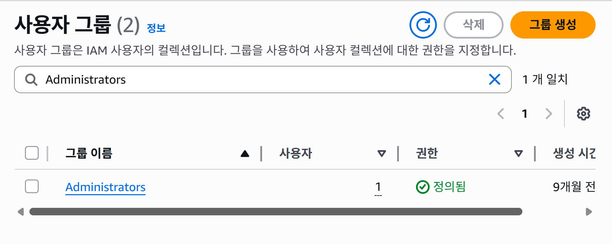
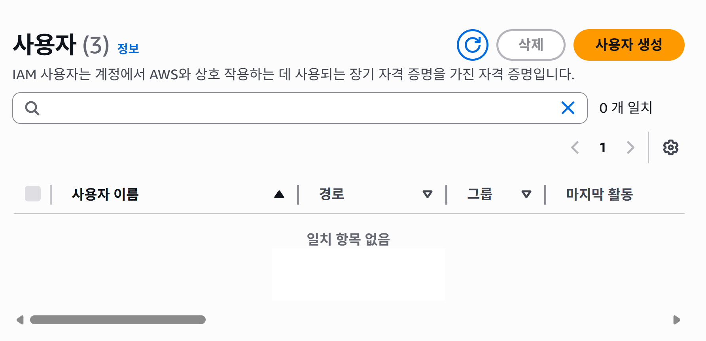
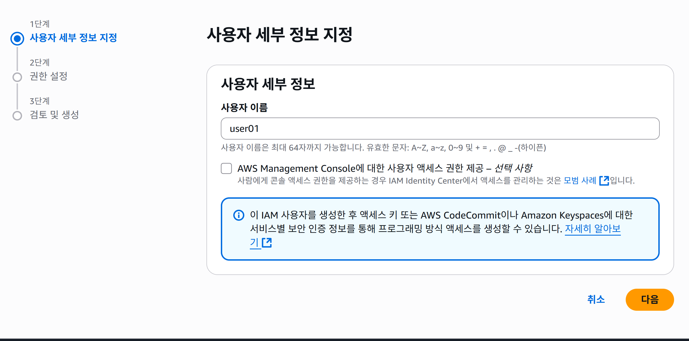
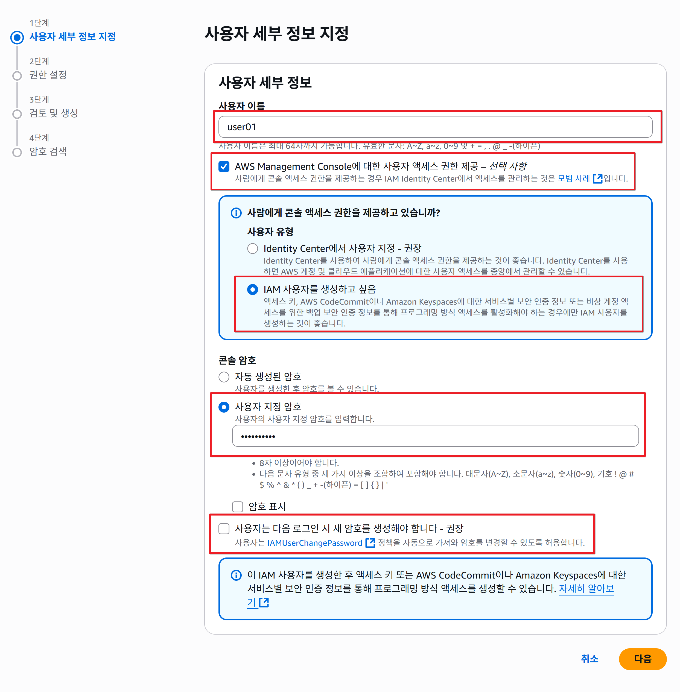
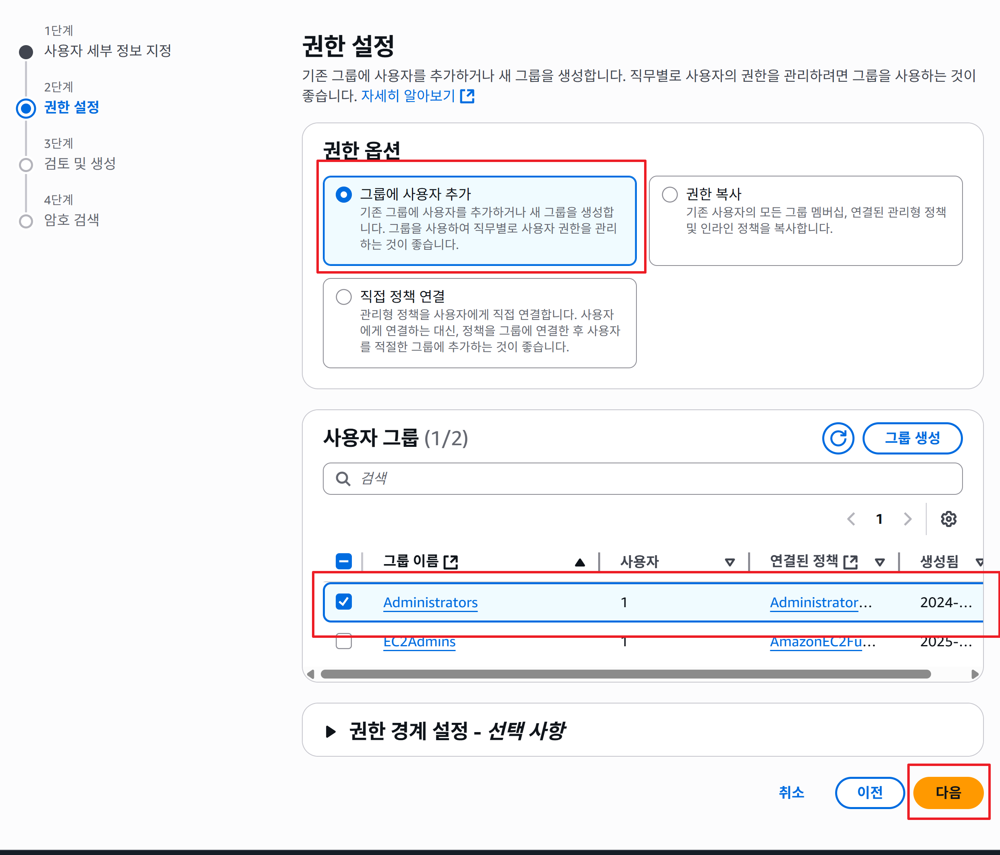
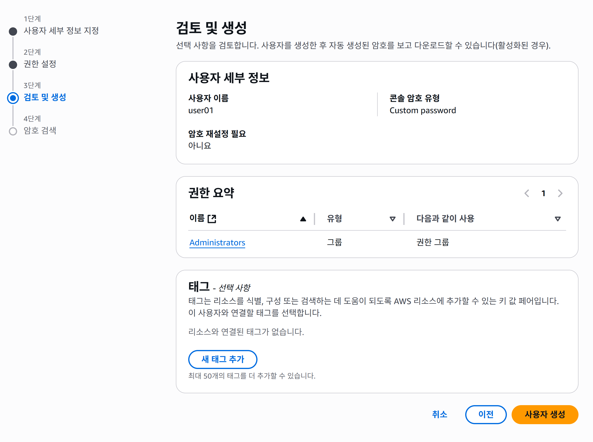
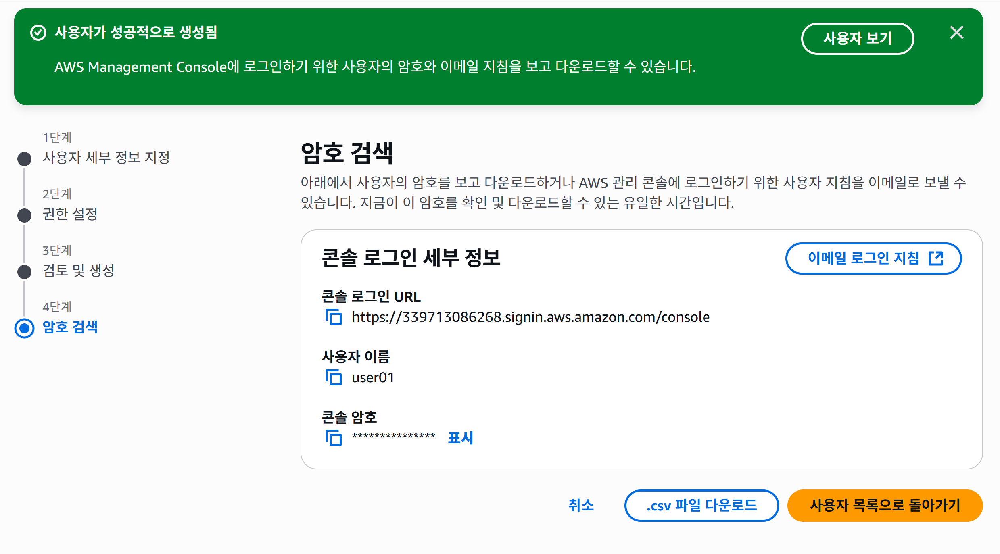
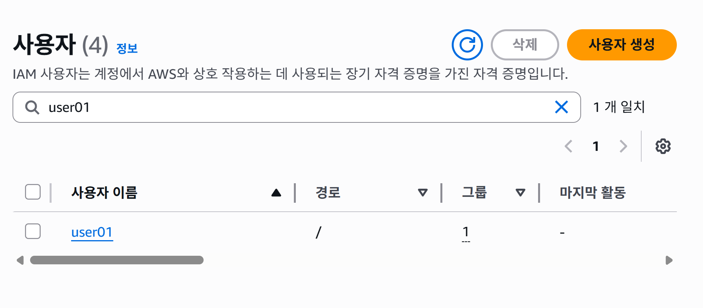

## AWS 사용자 그룹 및 사용자 

### 사용자 그룹 생성

1.  IAM 왼쪽 메뉴에서 **사용자** 그룹 메뉴를 클릭합니다 

2. 사용자 그룹 관리 페이지에서 오른쪽 상단에 있는 **그룹 생성** 버튼을 클릭합니다 

    

3. 사용자 그룹 생성 페이지에서 그룹 이름을 본인이 원하는 이름을 입력합니다 (예: Administrators)
    

4.  하단에 **사용자 그룹 생성** 버튼을 클릭하여 생성합니다

5. 사용자 그룹 생성 후 목록으로 이동한 화면 입니다 .

    

---

### 실습1 

1. 사용자 그룹 이름은 EC2Admins으로 하고, 권한은 AmazonEC2FullAccess으로 설정해서 생성 해보세요 

---

### 사용자 생성

1.  IAM 왼쪽 메뉴에서 **사용자** 메뉴를 클릭합니다 

2. 사용자 페이지에서 오른쪽 상단에 있는 **사용자 생성** 버튼을 클릭합니다 

    

3. 사용자 세부 정보 지정 페이지에서 사용자 이름을 본인이 원하는 이름을 입력합니다 (예: user01)
    
    

    - `AWS Management Console에 대한 사용자 엑세스 권한 제공 - 선택사항` 을 선택합니다.  아래 추가 선택 항목에서 `IAM 사용자를 생성하고 싶음'을 선택합니다 

    
    

4. 하단에 **다음** 버튼을 클릭합니다

5. 권한 설정 페이지에서 권한을 다음 화면과 같이 설정합니다 
    
    

6. 검토 및 생성 페이지에서 생성하려고 하는 사용자의 정보가 맞는지 확인 하고 잘못된 것이 있으면 수정하고 모든 것이 맞다면 우측 하단의 **사용자 생성** 버튼을 클릭합니다 

    

7. 사용자가 성공적으로 생성되면 암호 검색을 할 수 있는 페이지로 이동을 합니다. 이때 자동으로 생성된 암호를 csv 파일로 다운 받을 수 있습니다. 확인하고 우측 하단의 ** 사용자 목록으로 돌아가기** 버튼을 클릭하여 사용자 목록으로 이동합니다 
    

8. 사용자 목록 페이지

    

---

### 실습2 

1. root 계정 로그아웃하고, 교육시 생성한 user01로 로그인을 한 후 진행 해 주세요 

2. 사용자 이름은  aws-admin로 하고,  그룹은 Administrators으로 설정해서 생성 해보세요 

3. 사용자 이름은 kosa-user로 하고,  그룹은 EC2Admins으로 설정해서 생성 해보세요 

4. 사용자 user01을 로그 아웃하고, aws-admin으로 로그인 한 후 user01 계정을 삭제해보세요 

---
