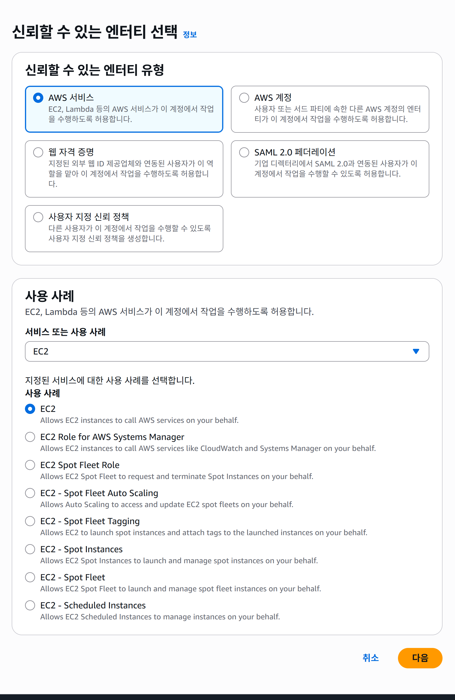
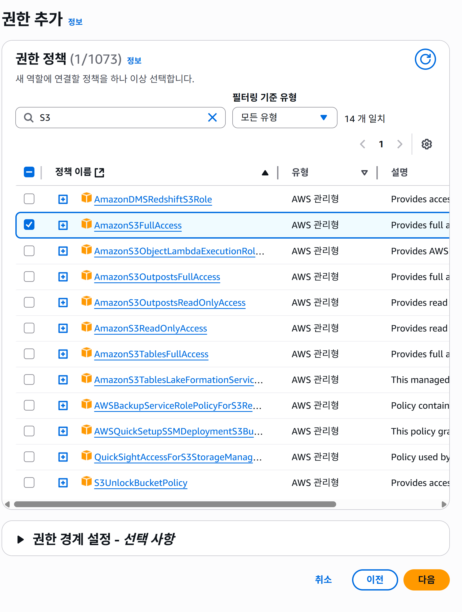
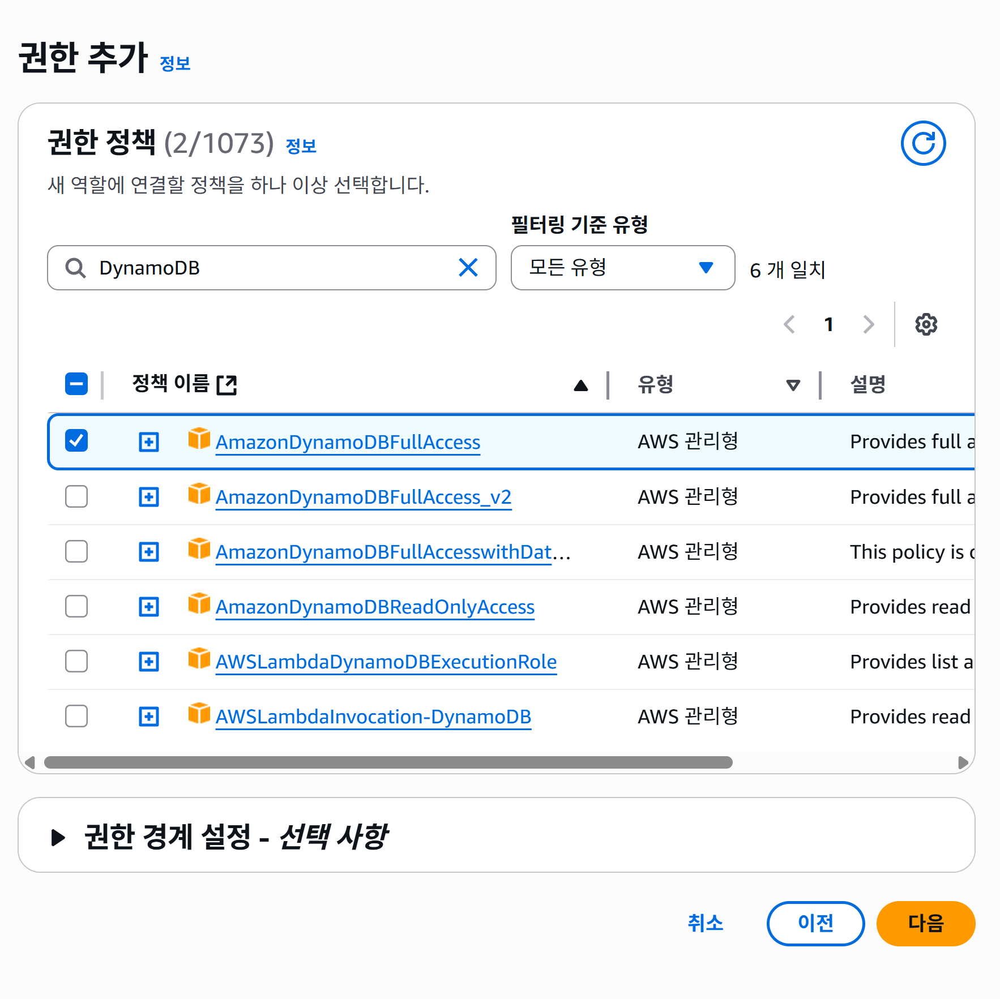
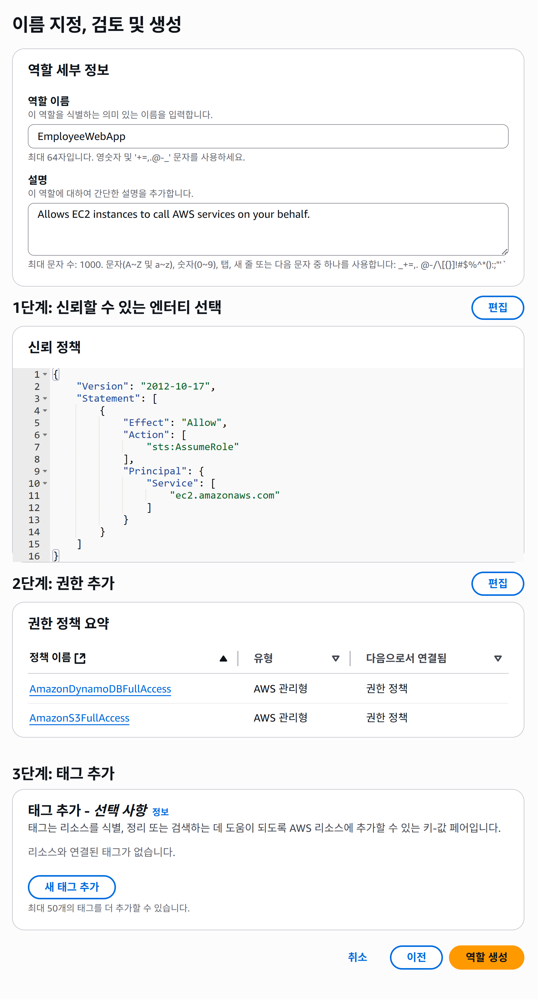
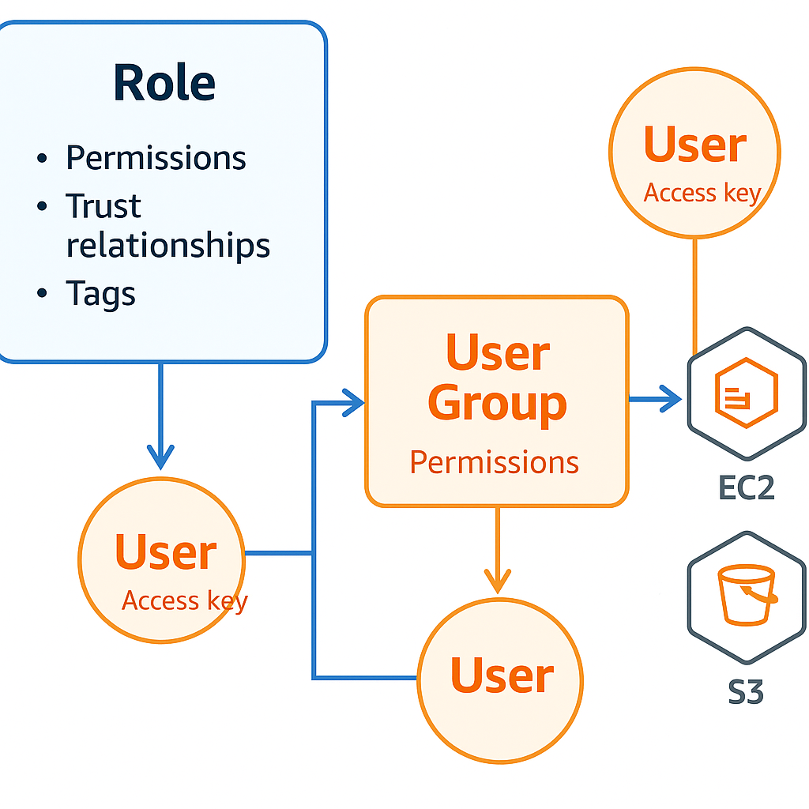

### IAM 역할 생성 

 직원 디렉터리 애플리케이션에 대한 IAM 역할을 생성 하려고 합니다. 그리고 사용자를 생성하는 방법을 알아보고 AWS API에 프로그래밍 방식으로 액세스하는 데 사용되는 다양한 AWS 액세스 키를 살펴보겠습니다. 

 
 
 1. 먼저 IAM 대시보드의 왼쪽 탐색 창에 있는  **역할** 메뉴항목를 선택하고 **역할 생성** 을 선택하여 애플리케이션에 대한 역할을 만듭니다. 
 2. 이 페이지에서는 이 역할을 수임할 신뢰할 수 있는 엔터티가 무엇인지 선택해야 합니다. 우리는 역할을 사용해서 AWS API 호출을 수행하는 데 사용되는 임시 자격 증명에 액세스할 수 있다는 것을 알고 있습니다.  
 

 
위 화면과 같이선택 하고 우측 하단에 있는 **다음** 버튼을 클릭합니다 

3. 권한 추가 페이지에서 권한에 대한 것을 선택합니다.
 
    추가 해야하는 권한은 S3와 DynamoDB입니다. 

    #### S3와 DynamoDB 추가 절차 

    1. 왼쪽 검색 창에 S3를 입력하고 Enter 키를 누르고 목록에서 AmazonS3FullAccess를 선택합니다 

    

    2. 왼쪽 검색 창에 DynamoDB를 입력하고 Enter 키를 입력하고 누르고 목록에서 AmazonDynamoDBFullAccess 정책을 선택합니다. 

    

    3. **다음** 버튼을 클릭합니다. 
    
    4. 역할 이름 지정, 검토 및 생성 페이지에서 역할을 생성합니다 

    역할 이름에 EmployeeWebApp 입력하고 아래로 스크롤 하고 **역할 생성** 버튼을 클릭합니다 

    

---

### 🟦 AWS IAM: 역할(Role)과 사용자(User) 정리 

#### 역할(Role) 이란?

정의: AWS 리소스에 어떤 작업(읽기, 쓰기, 생성 등)을 할 수 있는지 권한을 모아둔 것.

특징:

특정 사용자에게만 고정된 것이 아님 → 여러 사용자나 서비스가 필요할 때 맡아서 사용 가능.

권한(Policy), 신뢰 관계(어떤 서비스/사용자가 이 역할을 쓸 수 있는지), 태그 등을 확인 가능.

👉 예:
EmployeeWebApp 역할을 만들면, S3와 DynamoDB에 접근할 수 있는 권한을 가짐.
EC2 인스턴스나 사용자가 이 역할을 "맡으면" 해당 권한을 사용 가능.

#### 사용자(User) 생성하기

정의: 실제 사람이 AWS에 로그인하거나, 프로그래밍 방식(API/CLI)으로 접근할 때 쓰는 계정.

생성 절차:

Users → Add users 클릭

사용자 이름 입력 (예: EC2Admin)

Enable console access 체크
→ AWS 웹 콘솔에 로그인할 수 있도록 허용

초기 비밀번호 설정 (첫 로그인 시 변경하게 설정 가능)

#### 사용자 그룹(Group)과 권한 부여

그룹 생성: EC2Admins라는 그룹 만들기

정책 연결: 그룹에 AmazonEC2FullAccess 같은 권한 정책 부여

사용자 추가: 사용자를 그룹에 넣으면 → 그룹 권한을 자동 상속

👉 모범 사례:
사용자에 직접 권한을 주지 말고 → 그룹을 통해서 권한 관리
(운영하기 쉽고 실수 방지)

#### 액세스 키(Access Keys)

정의: 사용자가 명령줄(CLI)이나 SDK로 AWS를 사용할 수 있도록 발급되는 키.

구성:

Access Key ID

Secret Access Key (비밀키 → 꼭 안전하게 보관해야 함)

사용 예시:
로컬 PC에서 AWS CLI 설정 시 입력 → 이후 터미널에서 aws s3 ls 같은 명령 실행 가능.

#### 관리와 보안

필요 없으면 Access Key 비활성화/삭제

콘솔에서는 **비밀번호 변경 권한(IAMUserChangePassword)**도 직접 부여 가능

역할/사용자는 Actions 메뉴에서 삭제하거나 수정 가능

---
📌 핵심 요약

역할(Role) = 권한을 담은 "권한 묶음" (서비스/사용자가 맡아서 사용)

사용자(User) = 실제 로그인하거나 API/CLI로 AWS에 접근하는 계정

그룹(Group) = 여러 사용자에게 권한을 쉽게 관리하기 위한 모음집

액세스 키 = 프로그래밍 방식으로 AWS를 사용할 때 필요한 "비밀번호 세트"

### 실습1

역할의 이름은 S3DynamoDBFullAccessRole으로 하고, 권한으로는 AmazonDynamoDBFullAccess, AmazonS3FullAccess이 설정되게 만드세요.

참고 : 스킬빌더 교육중 남자강사가 진행을 할 때 IAM 권한은 S3DynamoDBFullAccessRole을 사용 하기 때문에 만드는 것음 

### AWS Skill Bulder Lab 참조
[Introduction to AWS Identity and Access Management (IAM) (한국어)](https://skillbuilder.aws/learn/XFPX3M7HAQ/introduction-to-aws-identity-and-access-management-iam-/MT6TK15E48)
