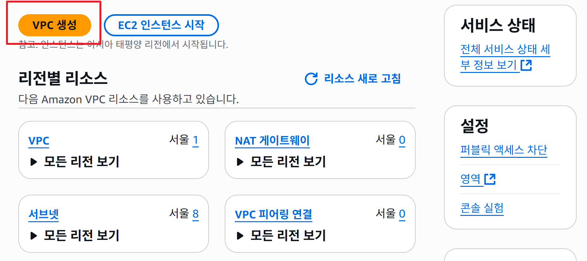
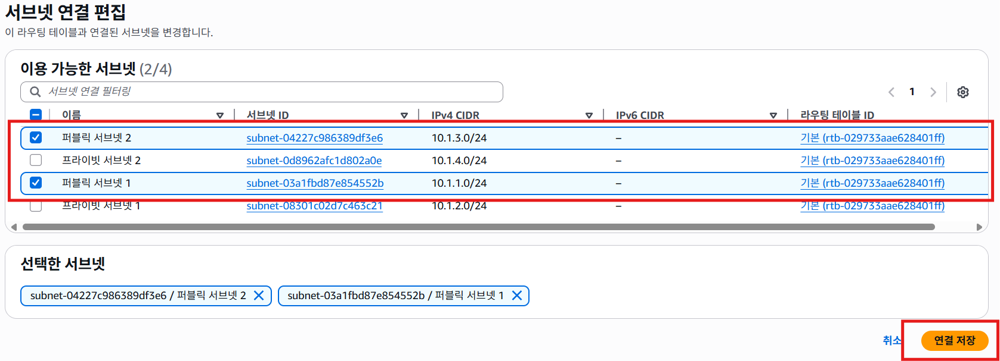

## 데모: Amazon EC2에서 직원 디렉터리 애플리케이션 다시 시작

### 📌 현재 VPC 네트워크 및 EC2 배포 흐름
#### 1. VPC 생성

1. VPC 를 검색하고 PVC 대시보드 화면으로 이동하여 VPC 버튼을 클릭합니다 


2. 다음과 같이 입력하고 우측 하단의 VPC 생성 버튼을 클릭합니다
    - **이름**: app-vpc
    - **CIDR 범위**: 10.1.0.0/16


3. 생성된  VPC 상세 정보를 확인합니다 


---

#### 2. 서브넷 생성 (총 4개)

1. 왼쪽에 있는 `서브넷` 메뉴 항목을 클릭합니다 


2. VPC 선택 화면에서 이전에 입력한 app-vpc를 선택합니다.


3. **퍼블릭 서브넷 1** → ap-northeast-2a, CIDR: 10.1.1.0/24, 입력하고 새 서브넷 추가 버튼을 클릭한다 


4. **프라이빗 서브넷 1** → ap-northeast-2a, CIDR: 10.1.2.0/24, 입력하고 새 서브넷 추가 버튼을 클릭한다 


5. **퍼블릭 서브넷 2** → ap-northeast-2b, CIDR: 10.1.3.0/24, 입력하고 새 서브넷 추가 버튼을 클릭한다 


6. **프라이빗 서브넷 2** → ap-northeast-2b, CIDR: 10.1.4.0/24, 입력하고 우측 하단의 서브넷 생성 버튼을 클릭여 서브넷을 생성합니다


7. 생성된 서브넷 목록 화면을 확인합니다 


---

#### 3. 인터넷 게이트웨이(IGW)
1. 인터넷 게이트웨이 생성을 하기 위해 왼쪽에 있는 `인터넷 게이트웨이` 메뉴 클릭니다 


2. 우측 상단에 있는 `인터넷 게이트웨이 생성` 버튼을 클릭합니다 


3. **이름**: app-igw을 입력 하고 하단에 있는 `인터넷 게이트웨이 생성` 버튼을 클릭합니다


4. 생성된 인터넷 게이트웨이 상세 정보를 확인하고 VPC에 연결 버튼을 클릭합니다


5. 생성된 인터넷 게이트웨이에 이전에 생성한 VPC(app-vpc)를 연결합니다 


- **특징**: 1:1 관계 (하나의 IGW ↔ 하나의 VPC)

---

#### 4. 라우팅 테이블
1. 라우팅 테이블 생성을 하기 위해 왼쪽에 있는 `라우팅 테이블` 메뉴 클릭합니다 


2. 우측 상단에 있는 `라우팅 테이블 생성` 버튼을 클릭합니다 


3. **이름**: public-route-table,  연결된 VPC: app-vpc을 입력하고 하단에 있는 `라우팅 테이블 생성` 버튼을 클릭합니다


4. 라우팅 규칙을 편집 하기위해 `라우팅 편집` 버튼을 클릭한다 


    - Local → VPC 내부 통신 (자동 생성)

    - `라우팅 추가` 버튼을 클릭합니다
    

    - 0.0.0.0/0 → Target: app-igw (인터넷 트래픽 허용) 입력 하고 우측 하단의 `변경 사항 저장` 버튼을 클릭합니다 
    

    - 등록된 라우팅 규칙을 확인합니다 
    

- **서브넷 연결**: Public Subnet 1, Public Subnet 2
    - 라우팅 추가 등록된 상세 화면에서 `서브넷 연결`탭을 클릭하고 `서브넷 연결 편집` 버튼을 클릭합니다 
    
     

    
     `퍼블릭 서브넷 1, 퍼블릭 서브넷 2`을 선택하고 우측 하단의 `연결 저장` 버튼을 클릭합니다 

     

     명시작 서브넥 연결된 결과 화면 

    

---

5. 보안 그룹

- 왼쪽에 있는 보안 그룹 메뉴 항목을 클릭하여 보안 그룹을 관리할 수 있는 페이지로 이동합니다 


- 우측 상단에 있는 `보안 그룹 생성` 버튼을 클릭하여 보안 그룹 생성 페이지로 이동합니다


- 보안 그룹 이름은 app-sg, VPC는 app-vpc 를 선택합니다 


- 인바운드 규칙:

    - HTTP (TCP 80) → 0.0.0.0/0 허용

    - HTTPS (TCP 443) → 0.0.0.0/0 허용

- 아웃바운드 규칙: 모든 트래픽 허용 (기본값)

- 우측 하단의 `보안 그룹 생성`을 클릭하여 보안 그룹 생성을 진행합니다 


- 등록 된 상세 페이지 에서 등록된 정보를 확인합니다 


---

6. EC2 인스턴스 (직원 디렉터리 앱)

- **AMI**: Amazon Linux 2

- **타입**: t3.micro (프리 티어)

- **VPC**: app-vpc

- **서브넷**: Public Subnet 1

- **퍼블릭 IP**: 자동 할당 (Enabled)

- **보안 그룹**: app-sg

- **User Data 스크립트**:
    EC2 서버 생성시 사용하는 스크립트 
    ```
    #!/bin/bash -ex
    wget https://aws-tc-largeobjects.s3-us-west-2.amazonaws.com/DEV-AWS-MO-GCNv2/FlaskApp.zip
    unzip FlaskApp.zip
    cd FlaskApp/
    yum -y install python3-pip
    pip install -r requirements.txt
    yum -y install stress
    export PHOTOS_BUCKET=employee-photo-bucket-sr-888
    export AWS_DEFAULT_REGION=ap-northeast-2
    export DYNAMO_MODE=on
    FLASK_APP=application.py /usr/local/bin/flask run --host=0.0.0.0 --port=80
    ```

7. 최종 결과

- 새 app-vpc 내에서 직원 디렉터리 앱 EC2 인스턴스가 실행됨.

- 브라우저에서 인스턴스의 퍼블릭 IP로 접속 가능.

- 퍼블릭 서브넷 → IGW → 인터넷 접근 정상 동작 확인 완료.

---

#### 👉 지금 상태는 VPC + 2개의 AZ, 4개의 서브넷 + IGW + 라우팅 테이블 + 보안 그룹 + EC2가 모두 구성된 완전한 네트워크 아키텍처입니다.

### AWS Skill Bulder Lab 참조
[Introduction to Amazon Virtual Private Cloud (VPC) (한국어)](https://skillbuilder.aws/learn/PH6Z6EVH8Z/introduction-to-amazon-virtual-private-cloud-vpc-/KQTDYUWHXN)
