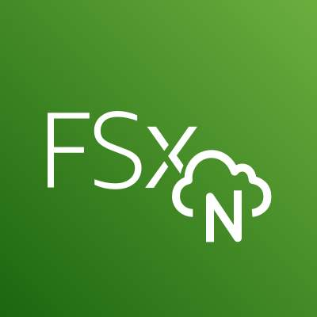
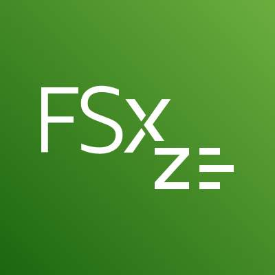
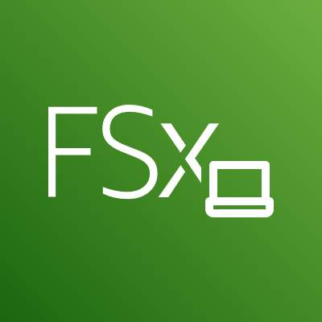
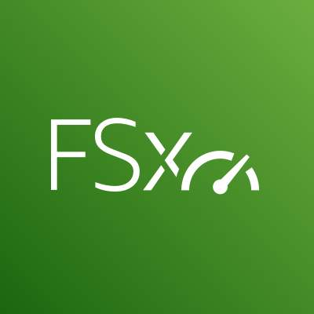

### Amazon EFS 및 Amazon FSx에서 파일 스토리지 사용

### Amazon Elastic File System(Amazon EFS)

Amazon Elastic File System(Amazon EFS)

Amazon Elastic File System(Amazon EFS)은 파일을 추가하고 삭제함에 따라 자동으로 확장되고 축소되는 특징이 있어 한 번 설정하고 나면 신경 쓰지 않아도 되는 파일 시스템입니다. 스토리지 용량과 성능을 프로비저닝하고 관리할 필요가 없습니다. Amazon EFS는 AWS 컴퓨팅 서비스 및 온프레미스 리소스와 함께 사용할 수 있습니다. 수십 개, 수백 개 또는 수천 개의 컴퓨팅 인스턴스를 동시에 Amazon EFS 파일 시스템에 연결할 수 있으며, Amazon EFS는 각 컴퓨팅 인스턴스에 일관된 성능을 제공합니다.

Amazon EFS의 간단한 웹 인터페이스를 사용하면 최소 수수료 또는 설정 비용 없이 파일 시스템을 빠르게 생성하고 구성할 수 있습니다. 사용한 스토리지에 대해서만 비용을 지불하며, 다양한 스토리지 등급 중에서 사용 사례에 맞는 것을 선택하면 됩니다. 

|Standard 스토리지 등급|One Zone 스토리지 등급|
|-----|-----|
|EFS Standard 및 EFS Standard-Infrequent Access(Standard-IA)는 다중 AZ 복원력과 최고 수준의 내구성 및 가용성을 제공합니다.|EFS One Zone 및 EFS One Zone-Infrequent Access(EFS One Zone-IA)를 사용하면 데이터를 하나의 가용 영역에 저장하여 추가로 비용 절감이 가능합니다.|

### Amazon FSx

Amazon FSx

Amazon FSx는 클라우드에서 고성능 파일 시스템을 쉽고 비용 효율적으로 시작, 실행, 규모 조정하는 데 도움이 되는 다양한 기능과 함께 신뢰성, 보안, 확장성을 제공하는 완전관리형 서비스입니다. Amazon FSx를 사용하면 널리 사용되는 4가지 파일 시스템, 즉 Lustre, NetApp ONTAP, OpenZFS, Windows File Server 중에서 선택할 수 있습니다. 파일 시스템에 대한 익숙함이나 워크로드의 기능 집합, 성능 프로필, 데이터 관리 기능 요구 사항에 따라 선택할 수 있습니다.

1. Amazon FSx for NetApp ONTAP
    Amazon FSx for NetApp ONTAP은 완전관리형 서비스입니다. 민첩성, 확장성 및 단순성이라는 완전관리형 AWS 서비스의 이점과 함께 온프레미스 NetApp 파일 시스템의 익숙한 특징, 성능, 기능 및 API 작업을 제공합니다. FSx for ONTAP은 기존 ONTAP 배포를 즉시 대체할 수 있으므로 고객은 클라우드에서 ONTAP 파일 시스템을 시작하고 실행하는 기능을 이용할 수 있습니다.

    FSx for ONTAP은 AWS 또는 온프레미스에서 실행되는 Linux, Windows 및 macOS 컴퓨팅 인스턴스에서 광범위하게 액세스할 수 있는 풍부한 관리 기능과 유연한 공유 파일 스토리지를 제공합니다.

    

2. Amazon FSx for OpenZFS

    Amazon FSx for OpenZFS는 애플리케이션 코드 혹은 데이터 관리 방법을 변경하지 않고도 온프레미스 ZFS 또는 기타 Linux 기반 파일 서버에 상주하는 데이터를 AWS로 쉽게 이동하는 데 도움이 되는 완전관리형 파일 스토리지 서비스입니다. FSx for OpenZFS를 사용하면 파일 서버와 스토리지 볼륨을 설정하고 프로비저닝하는 것을 신경 쓰지 않아도 됩니다. 데이터 복제, 파일 서버 소프트웨어 설치 및 패치 적용, 하드웨어 장애 탐지 및 해결, 수동 백업 또한 직접 처리하지 않아도 됩니다.

    FSx for OpenZFS는 인기 있는 NAS 데이터 관리 기능(스냅샷, 복제)을 여타 상용 라이선스 제품보다 낮은 가격에 제공함으로써 지연 시간에 민감하며 파일이 작은 워크로드에 우수한 성능을 제공합니다.

    

3. Amazon FSx for Windows File Server
    Amazon FSx for Windows File Server는 완전 네이티브 Windows 파일 시스템이 지원하며 신뢰성이 높고 확장 가능한 완전관리형 Microsoft Windows File Server를 제공합니다. FSx for Windows File Server는 Service Message Block(SMB) 프로토콜을 통해 액세스 가능한 파일 스토리지를 제공하며 기존 Windows 파일 서버 배포를 즉시 대체하는 기능을 제공합니다. 

    FSx for Windows File Server는 완전관리형 서비스이므로 파일 서버와 스토리지 볼륨을 설정하고 프로비저닝하는 관리 작업이 필요하지 않으며 Windows 애플리케이션을 구축하고 실행하는 고객이 쉽게 사용할 수 있습니다.

    

4. Amazon FSx for Lustre
    오픈 소스 Lustre 파일 시스템은 컴퓨팅 속도를 따라갈 수 있는 빠른 스토리지가 필요한 애플리케이션을 위해 설계되었습니다. Amazon FSx for Lustre를 사용하면 널리 사용되는 고성능 파일 시스템을 편리하고 비용 효율적으로 시작 및 실행하고 규모를 조정할 수 있습니다. FSx for Lustre 파일 시스템을 Amazon Simple Storage Service(Amazon S3)의 데이터 리포지토리 또는 온프레미스 데이터 스토어에 연결할 수 있습니다.

    FSx for Lustre는 가장 높은 처리량(최대 1TB/s 이상) 및 IOPS(수백만)를 발휘합니다. 고객은 Lustre 고성능 파일 시스템을 사용하여 Amazon S3 데이터 집합을 원활하게 통합하고 액세스하고 처리할 수 있습니다.

    