### Amazon S3 버킷 생성

### 📝 연습: S3 버킷 생성 후 EC2 애플리케이션에 연결하기(관리자 계정으로 진행)


#### 1. S3 버킷 생성

1. **콘솔 로그인** → 검색창에 S3 입력 후 이동

2. **버킷 만들기** 클릭
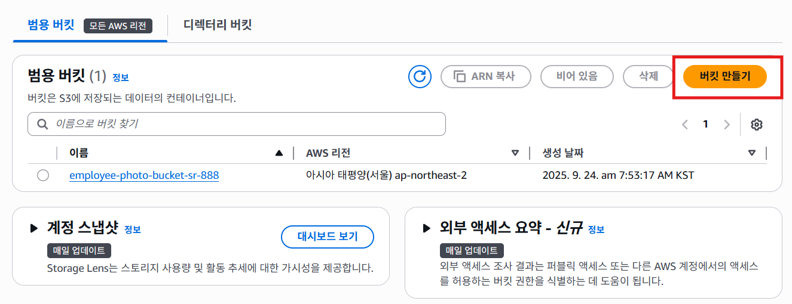


3. 버킷 이름: employee-photo-bucket-sr-888 (본인 이니셜 + 숫자)

  중요 : 이름은 전 **세계에서 유일**해야 하고, 공백·특수문자 ❌

  나머지는 기본값 그대로 → `버킥 만들기` 버튼을 클릭하여  버킷을 생성합니다 
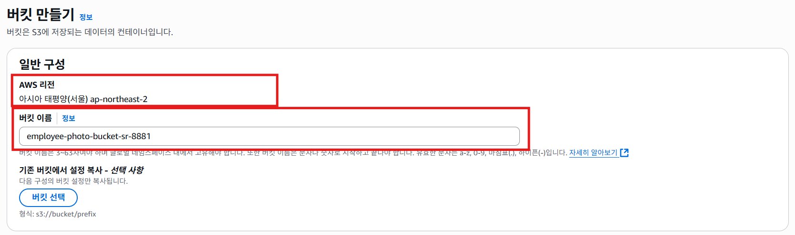
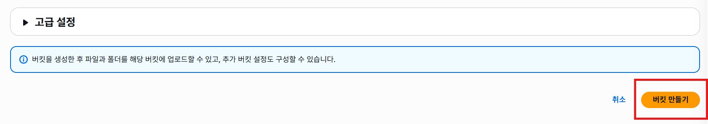

- 생성된 후 버킷 목록 화면입니다 
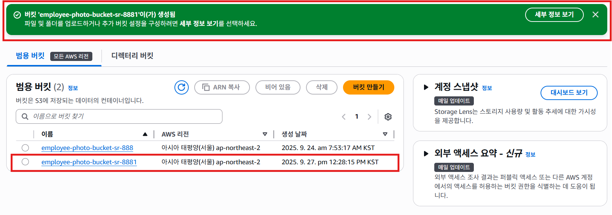


---

#### 2. 객체 업로드 테스트

1. 생성한 버킷 클릭 
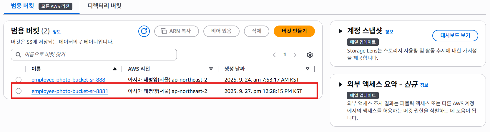

2. 우측 상단에 있는 `업로드 버튼`을 클릭합니다 
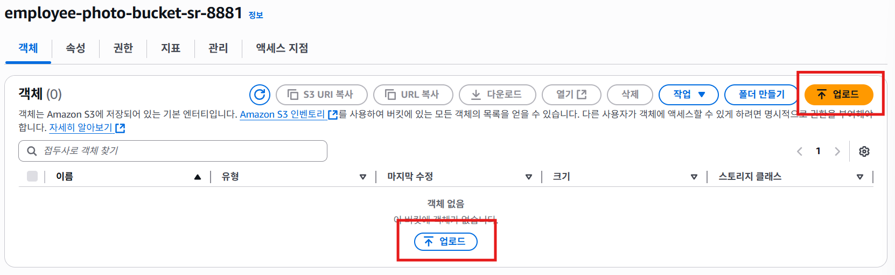

3. `파일 추가` 버튼을 클릭하여 업로드할 파일을 선택합니다 
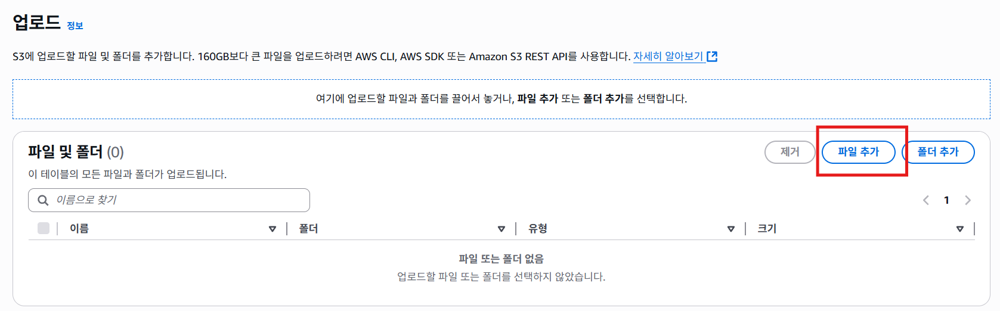

4. 추가된 파일을 목록에서 확인 할 수 있습니다 
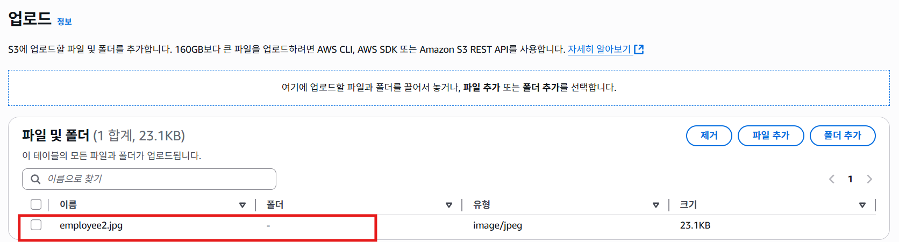

5. `업로드`버튼을 클릭하여 파일을 버킷에 추가합니다 
 

6. 완료 후 목록을 확인 합니다 
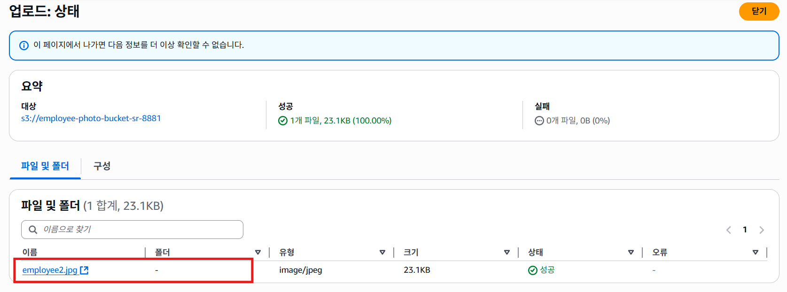

7. 업로드한 파일을 employee2.jpg 선택 하여 상세 정보를 확인합니다 
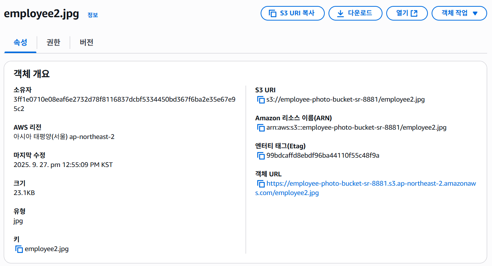

8. `다운로드` 버튼을 클릭하여 업로드한 파일을 다운로드하여 확인을 합니다 
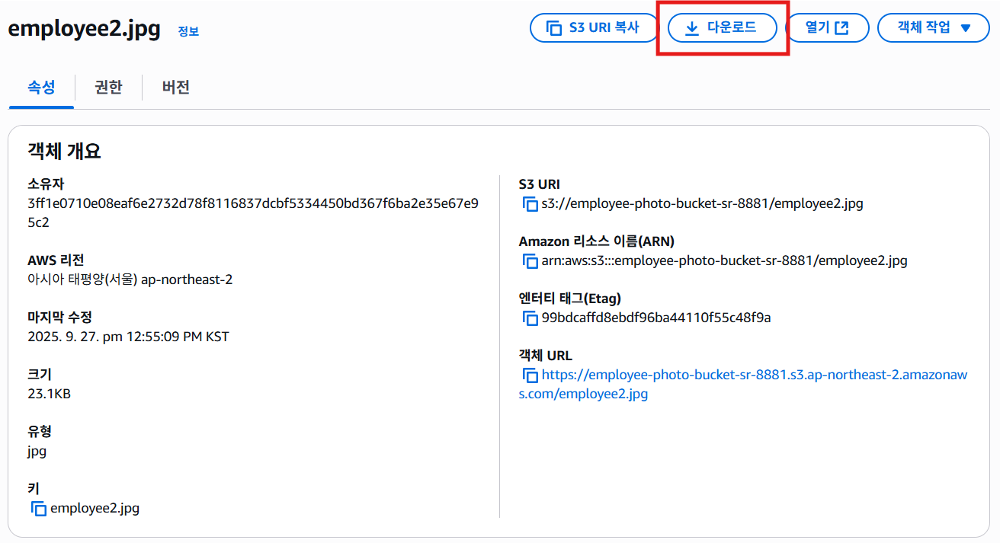


---

#### 3. 버킷 정책 수정 (IAM 역할 허용)

1. 버킷 → **권한 탭** → **퍼블릭 엑세스 차단(버킷 설정)** → **편집** 
퍼블릭 액세스 차단(버킷 설정) 해제를 해야 외부에 접근 가능합니다
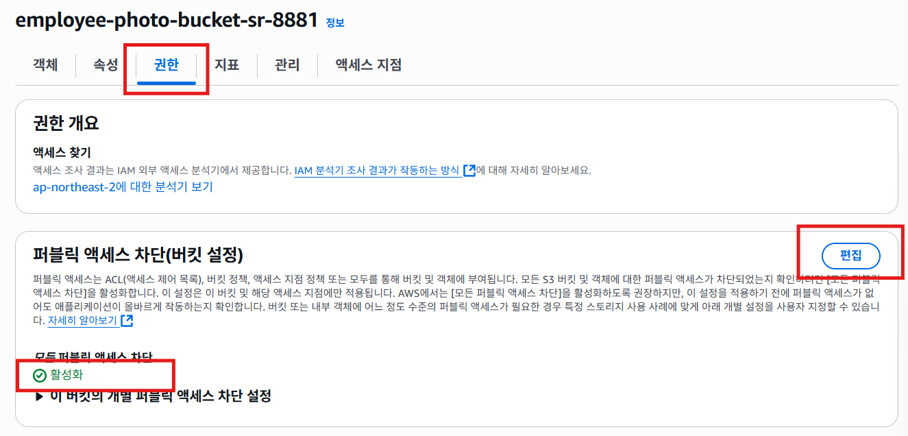

2. 모든 퍼블릭 액세스 차단을 해제하고 우측 하단의 `변경 사항 저장` 버튼을 클릭합니다
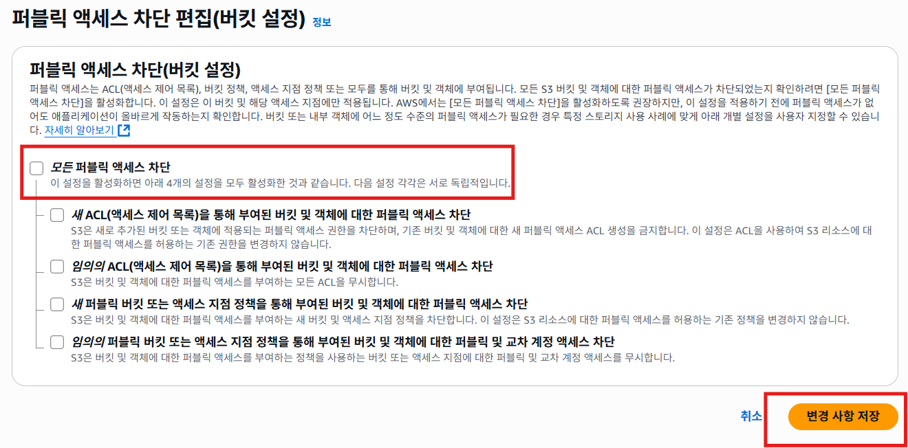

2. 아래 정책 붙여넣기 후 `<INSERT-ACCOUNT-NUMBER>`와 
`<INSERT-BUCKET-NAME>` 을 본인의 정보로 수정합니다

- INSERT-ACCOUNT-NUMBER : 339713086268
- INSERT-BUCKET-NAME : employee-photo-bucket-sr-888

```
{
  "Version": "2012-10-17",
  "Statement": [
    {
      "Sid": "AllowS3ReadAccess",
      "Effect": "Allow",
      "Principal": {
        "AWS": "arn:aws:iam::<INSERT-ACCOUNT-NUMBER>:role/S3DynamoDBFullAccessRole"
      },
      "Action": "s3:*",
      "Resource": [
        "arn:aws:s3:::<INSERT-BUCKET-NAME>",
        "arn:aws:s3:::<INSERT-BUCKET-NAME>/*"
      ]
    }
  ]
}
```
⚠️ 주의: S3DynamoDBFullAccessRole 이 IAM에서 **미리 생성되어 있어야 함**.

---

#### 4. EC2 인스턴스 재시작 (S3 연결)

1. **EC2 콘솔 → Instances**

2. 기존에 중지된 인스턴스 선택 → **Actions → Image and templates → Launch more like this**

3. 인스턴스 이름: employee-directory-app-s3

4. 네트워크 설정:

  - VPC: 기존과 동일

  - Subnet: Public Subnet

  - Auto-assign public IP: **Enable**

5. Advanced details → **IAM 역할 확인** (EmployeeWebApp S3 권한 있는 역할) 

6. **User data** 영역에 버킷 이름 설정 (앱이 S3 버킷 사용하도록)
    
    EC2 서버 생성시 사용하는 스크립트 
    ```
    #!/bin/bash -ex
    wget https://aws-tc-largeobjects.s3-us-west-2.amazonaws.com/DEV-AWS-MO-GCNv2/FlaskApp.zip
    unzip FlaskApp.zip
    cd FlaskApp/
    yum -y install python3-pip
    pip install -r requirements.txt
    yum -y install stress
    export PHOTOS_BUCKET=employee-photo-bucket-sr-888
    export AWS_DEFAULT_REGION=ap-northeast-2
    export DYNAMO_MODE=on
    FLASK_APP=application.py /usr/local/bin/flask run --host=0.0.0.0 --port=80
    ```

7. **Launch instance** 클릭

---

#### 5. 실행 확인

1. 인스턴스 상태가 running & **2/2 checks passed** 될 때까지 대기

2. 퍼블릭 IP 주소 복사 → 브라우저에 붙여넣어 앱 확인

  - 데이터베이스 연결은 아직이지만, 앱이 실행되는지만 확인

---
#### 6. 정리

- 테스트 끝나면:

  - 인스턴스 **중지**

  - S3 버킷 안의 **객체 삭제**

### AWS Skill Bulder Lab 참조
[Introduction to Amazon Simple Storage Service (S3) (한국어)](https://skillbuilder.aws/learn/R54NZHEX5K/introduction-to-amazon-simple-storage-service-s3-/1UKWXUSA33)

[S3 for Application Storage (한국어)](https://skillbuilder.aws/learn/U8S8ACMX1B/s3-for-application-storage-/DVM497S8TP)

[Lab - Create a Static Website with Amazon Simple Storage Service (Amazon S3) (한국어)](https://skillbuilder.aws/learn/2NMXKK69FU/lab--create-a-static-website-with-amazon-simple-storage-service-amazon-s3-/NC2Y18G9MJ)

