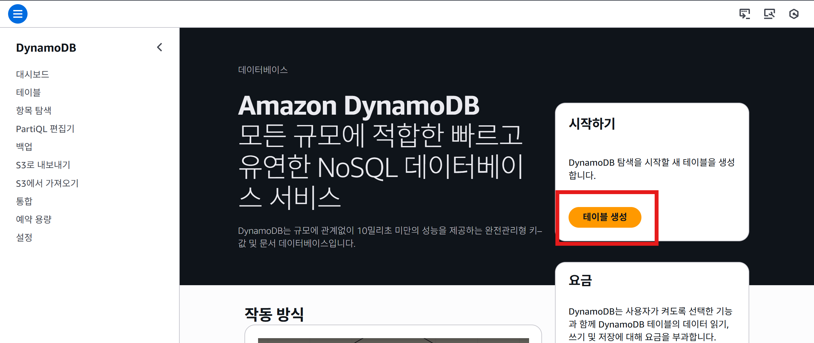
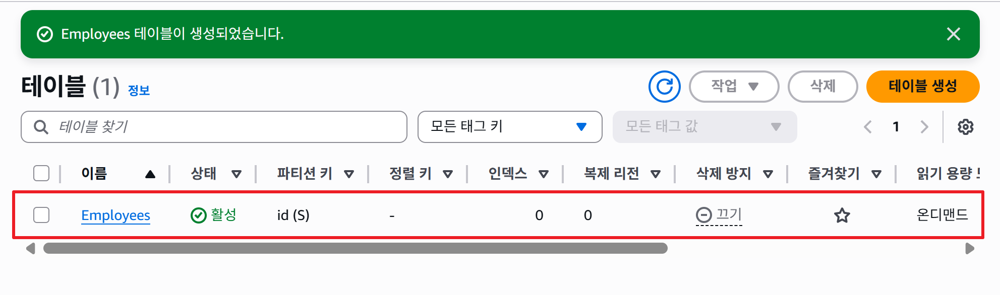

## Amazon DynamoDB 구현 및 관리

### 🏗️ 직원 디렉터리 앱 + DynamoDB 연습 과정
#### 1. 준비 단계: 인스턴스 실행

1. 기존 EC2 인스턴스 복제

    - employee-directory-app-s3 인스턴스를 선택 → `동작` → `이미지 및 템플릿` → `이런 방식으로 더 많이 시작`
    

    - 이름을 employee-directory-app-dynamodb 로 지정
    

    - 키 페어 확인

    - 네트워크 설정 확인

    - 퍼블릭 IP 자동 할당 (Auto-assign public IP = Enable)

    - 보안 그룹 확인

    - IAM 역할이 연결되어 있는지 확인

    - 인스턴스 시작 후 상태 확인

    - 2/2 checks passed 가 되면 준비 완료
    

    - VPC 확인 후 사설 IP 확인 해봅니다

    - 퍼블릭 IP로 접속해 애플리케이션이 정상 실행되는지 확인

---

#### 2. DynamoDB 테이블 생성

1. AWS 콘솔에서 **DynamoDB 서비스** 검색 후 접속 후 `테이블 생성` 버튼을 클릭합니다

2. 테이블 생성 페이지 

    - 테이블 이름: Employees

    - 파티션 키: id (타입 = String)

    - 나머지 옵션은 기본값

    - 우측 하단의 테이블 생성 버튼을 클릭하면 몇 초 후 테이블 생성 완료됩니다 
        

    - 테이블 관리 목록에서 생성된 테이블을 확인 할 수 있습니다 
    

----
#### 3. 애플리케이션 테스트

1. 인스턴스 퍼블릭 IP로 웹 앱 접속

2. **새 직원 추가**

    - 이름, 위치, 직책 입력
    - 배지 옵션 선택 
    - 직원 사진 업로드
    
    
3. 확인:

    - 웹 앱에 새 직원 항목이 표시됨
    
---

#### 4. 데이터 저장 확인

1. S3 버킷 확인

    - 업로드한 직원 사진이 객체로 저장됨

    - 애플리케이션이 자동으로 파일을 S3에 업로드
    

2. DynamoDB 확인 - AWS 콘솔에서 **DynamoDB 서비스** 검색 후 접속 합니다
    - 테이블 목록에서 `Employees` 테이블을 클릭합니다
    

    - 우측 상단의 `표 항목 탐색` 버튼을 클릭합니다
    

    - 등록된 id를 클릭하여 상세정보를 확인합니다 
    

    - 등록된 자료의 속성 페이지를 확인합니다 
    - id, 이름, 직책, 위치, 배지, 사진 파일명 등 속성이 저장됨
    

   
---

#### 5. 마무리

- 애플리케이션 동작 확인 후 **EC2 인스턴스 중지** (비용 절감 목적)

- DynamoDB 테이블과 S3 버킷은 그대로 남아 있음 → 다음 단계 실습에 활용 가능

