## Amazon CloudWatch

### 🌩️ Amazon CloudWatch 실습 정리
#### 1. 목표

- EC2 인스턴스의 **CPU 사용률을 시간에 따라 대시보드로 시각화**

- CPU 사용률이 **5분 동안 70% 초과** 시, **이메일 알림** 받기

---

#### 2. CloudWatch 대시보드 만들기

1. AWS 콘솔에서 **CloudWatch** 검색하여 이동합니다 

2. 대시보드를 생성하기 위해 `기본대시보드 생성` 버튼을 클릭합니다
    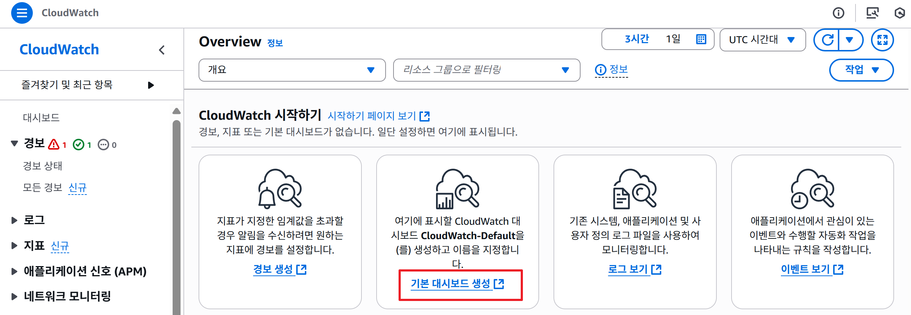

3. 대시보드관리 페이지에서 우측 상단의 `대시보드 생성`버튼을 클릭합니다.
    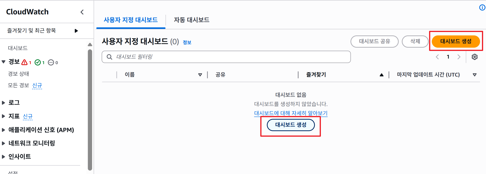

4. 이름: mydashboard 을 입력하고 우측 하단의 `대시보드 생성`버튼을 클릭합니다.
    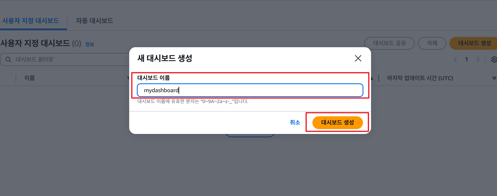

5. 데이터 유형 : 지표 선택, 위젯 유형 : **행 (시간별 지표 비교)** 후 `다음` 버튼을 클릭합니다 
    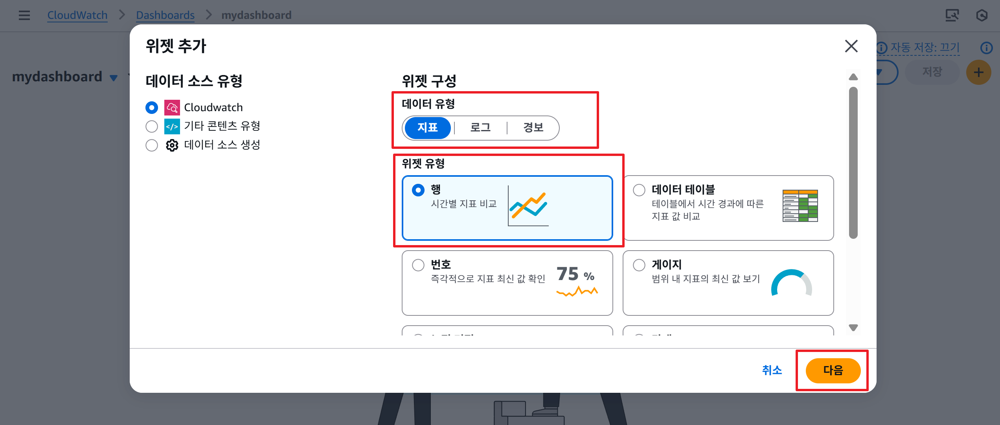

5. 지표그래트 추가 화면에서 EC2를 선택 후 인스턴스별 지표를 선택한다 
    -  EC2를 선택을 한다 
    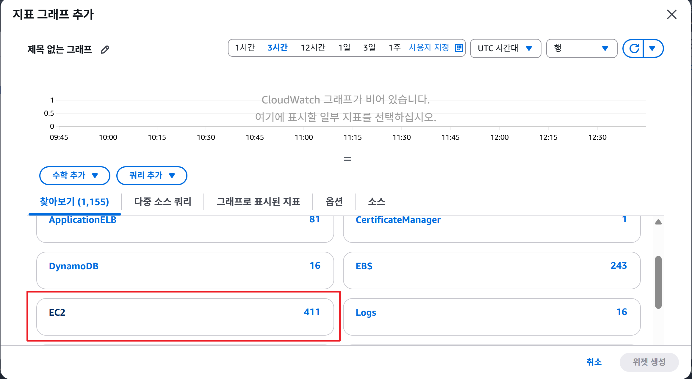

    -인스턴스별 지표를 선택
    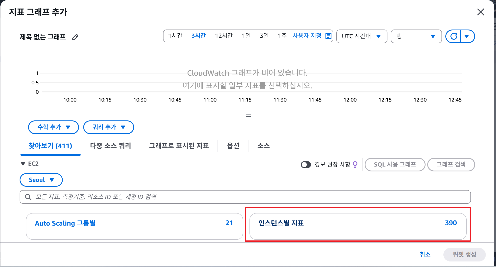

    - 인스턴스의 CPUUtilization 을 선택하고 `위젯 생성`버튼을 클릭한다 
    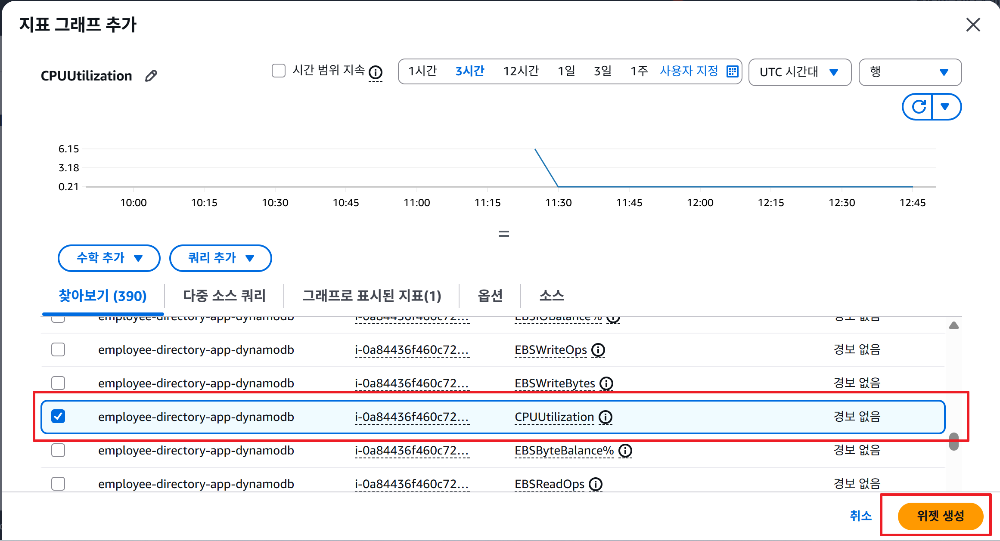

💡 Tip: 기본 지표는 인프라 상태만 보여줌 (예: CPU, 네트워크)
→ 애플리케이션 상태를 더 정확히 보려면 **사용자 지정 지표(Custom Metrics)** 추가 필요

6. 생성된 대시 보드의 결과를 모니터링 한다 
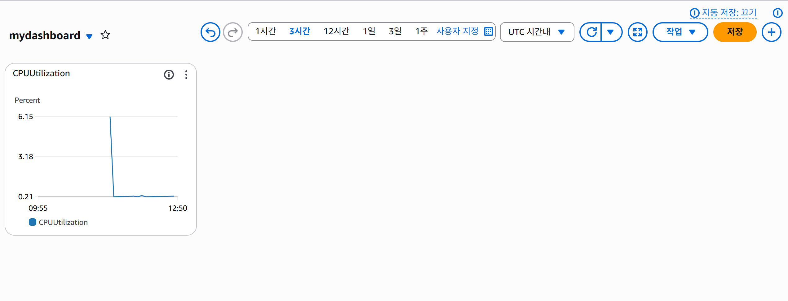

---

#### 3. CloudWatch 알람 만들기

1. 왼쪽 메뉴 `경보 상태`를 클릭하고 우측 상단의 `경보 생성` 버튼을 클릭합니다 
    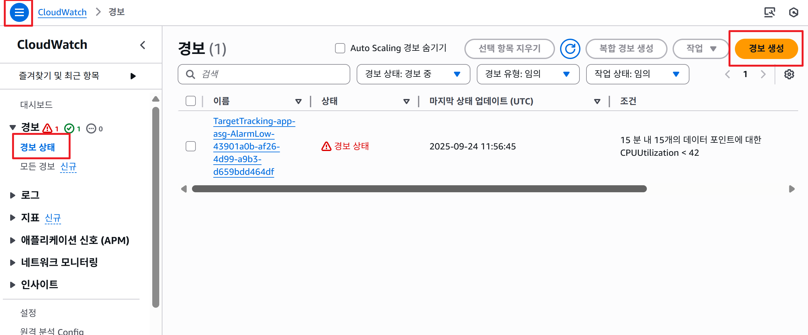   

2. 지표 선택: EC2 → Per-Instance Metrics → CPUUtilization
    - `지표 선택`을 클릭합니다 
    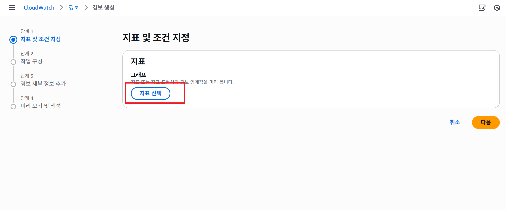

    - EC2 선택을 합니다 
    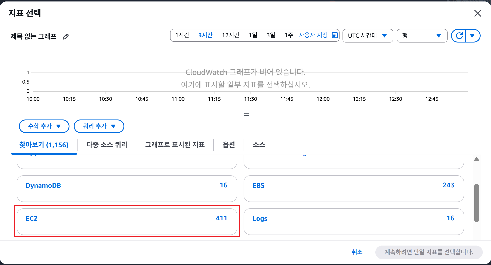

    - 인스턴스별 지표를 선택합니다 
    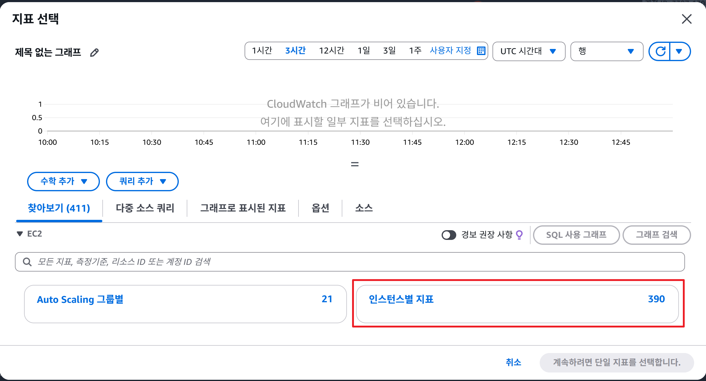

    - employee-directory-app-dynamodb 인스턴스의 CPUUtilization 지표를 선택하고 `지표 선택` 버튼을 클릭합니다 
    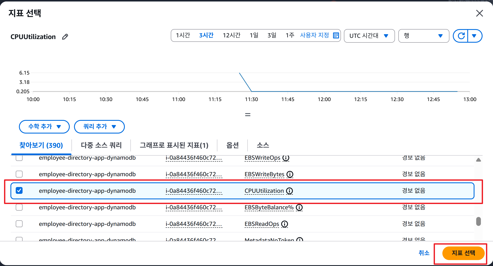

3. 조건 설정:

    - 기간: 5분

    - 임계값: 70% (5분 동안 CPU 사용률 > 70%면 알람 발생)
    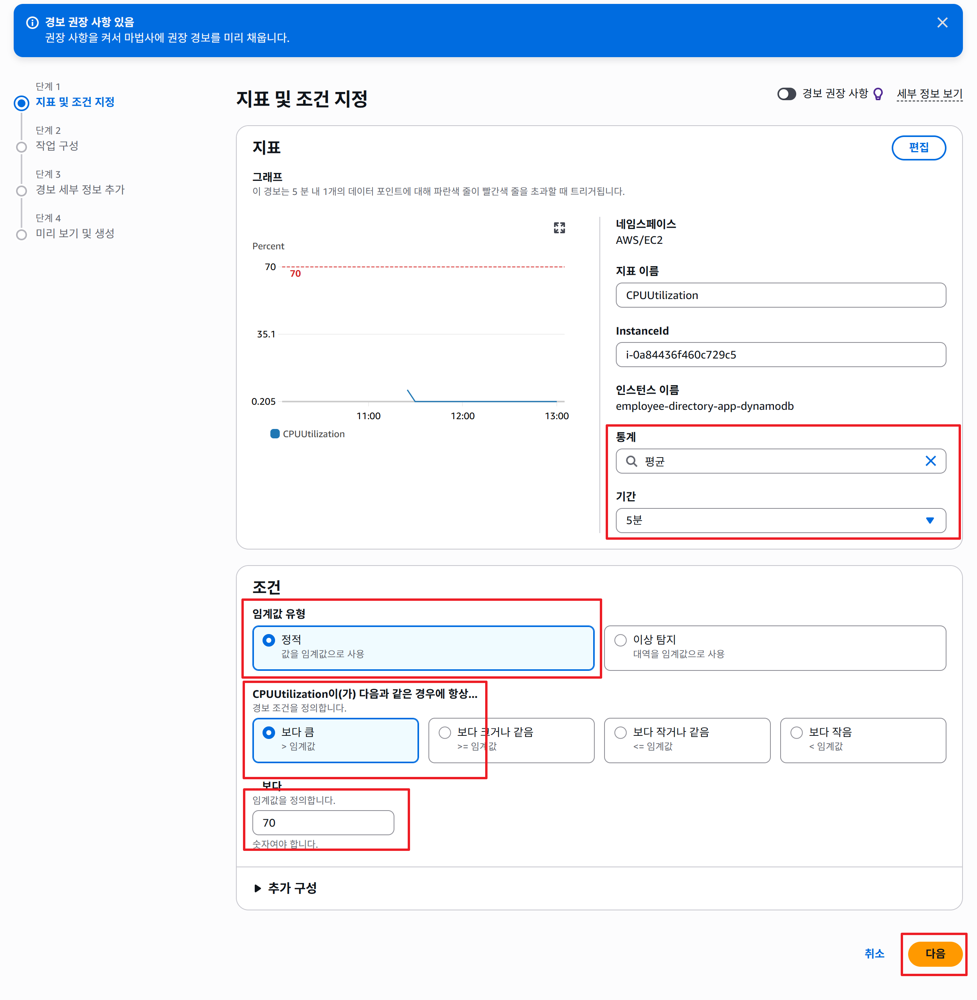

4. 알림 구성:
    - 새주제를 선택하고, 새 주제 생성...에 CPU_Utilization_Topic을 입력한다
    - 알림을 수신할 이메일 엔드포인트... 알림 받을 사람을 등록합니다(예 : masungil2@daum.net)
    - `주제 생성` 버튼을 클릭합니다
    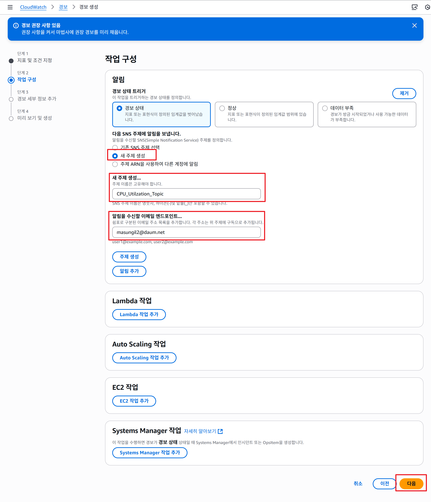

    - 등록이 되면 등록한 사람에게 이메일이 발송됩니다. 이메일을 확인 하고 구독 확인을 하셔야만 알람이 발송됩니다.(Confirm subscription)

    - 경보 세부 정보 추가 페이지에서 경보 이름을 CPU Utilization  alert으로 입력합니다. 
    - 경보 설명에 대하여 상황에 맞게 작성합니다 
    - 이후 `다음`버튼을 클릭하여 진행합니다 
    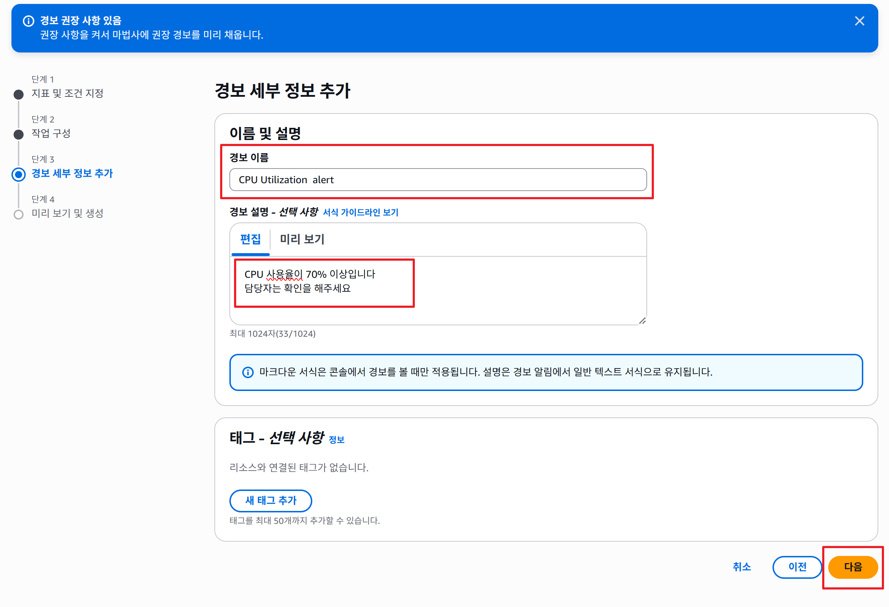

5. 미리 보기 및 생성 페이지에서 설정한 모든 것을 확인 하고 이상이 있을 경우 `편집` 버튼을 클릭하여 수정하실 수 있습니다. 수정할 것이 없으면 `경보 생성`버튼을 클릭합니다.
    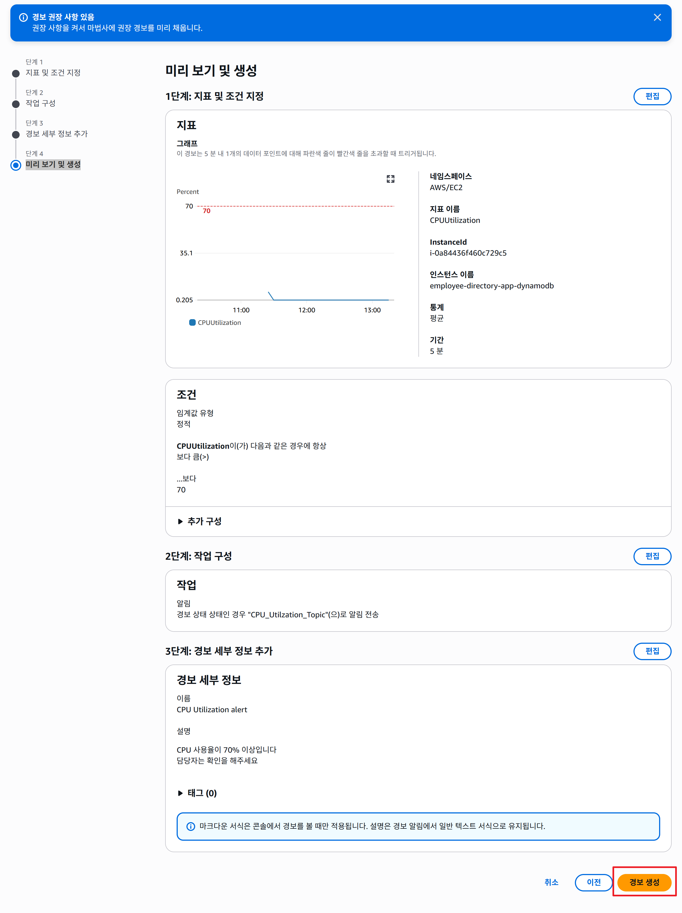

6. 등록 후 모든 경보 목록 화면으로 이동을 합니다 
    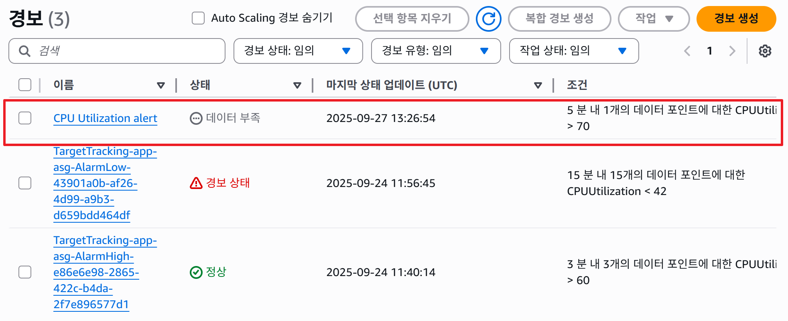

---

#### 4. 활용 시나리오

- ec2서버의 /info 페이지로 이동하여 ec2의 인스턴스명과 리젼, cpu 스트레스를 설정할 수 있는 페이지로 이동하여 테스트 할 수 있습니다

    📧 CPU 사용률 급증 시 → **시스템 관리자/개발자에게 자동 이메일 발송**
      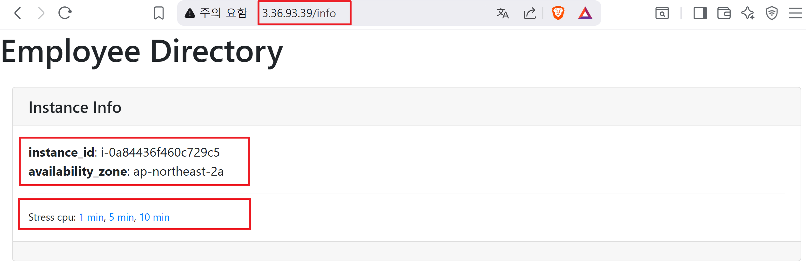

- 🚀 추후 확장: 알람이 발생하면 **EC2 Auto Scaling**을 자동으로 실행하여 인스턴스를 추가할 수도 있음

---

#### ✅ 정리하면:
CloudWatch를 사용하면 **EC2 성능을 실시간으로 모니터링**하고,
임계치 초과 시 **자동 알림 & 대응**이 가능해집니다.

---

### AWS Skill Bulder Lab 참조
[Collecting and Analyzing Logs with Amazon CloudWatch Logs Insights (한국어)](https://skillbuilder.aws/learn/UKDQEXHW73/collecting-and-analyzing-logs-with-amazon-cloudwatch-logs-insights-/A4UEN4T6H4)
